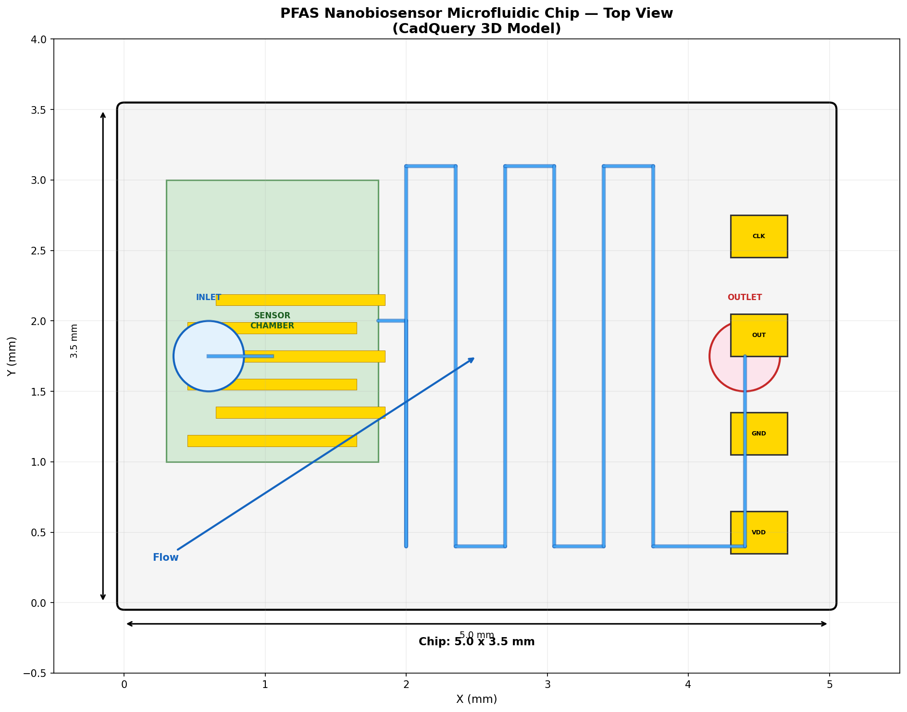
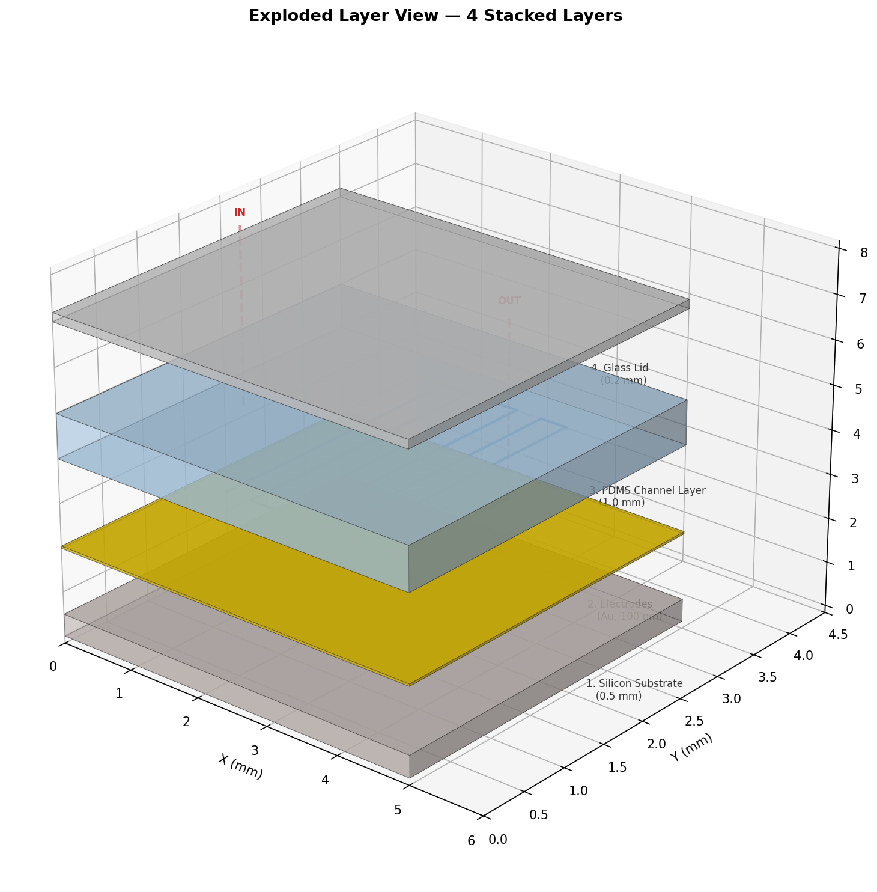
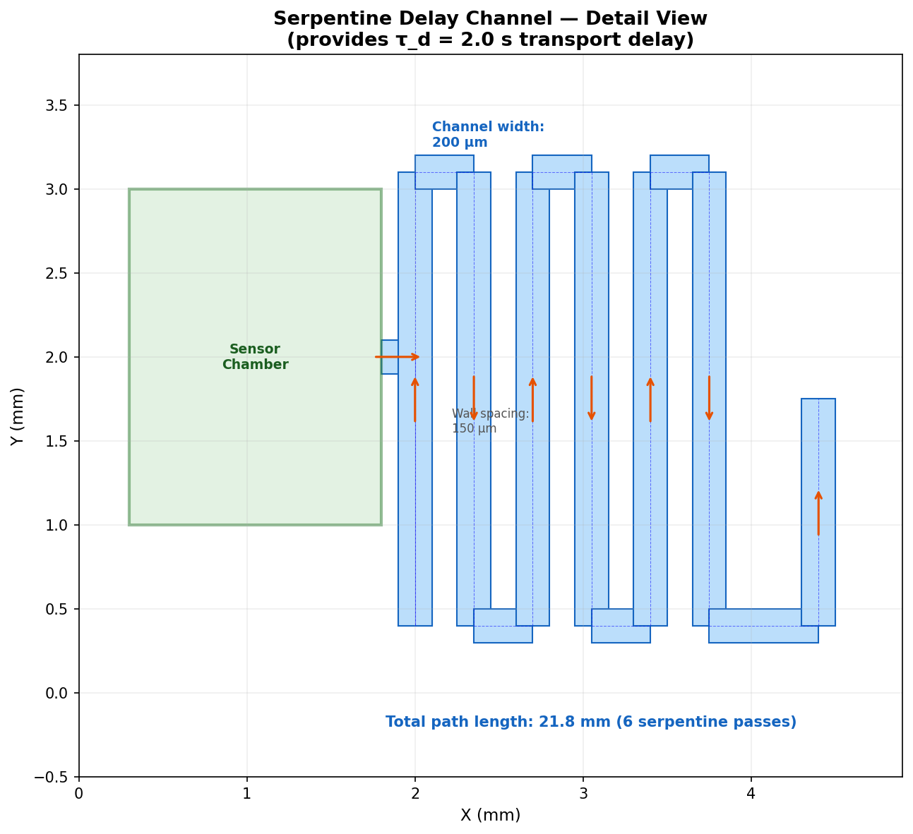
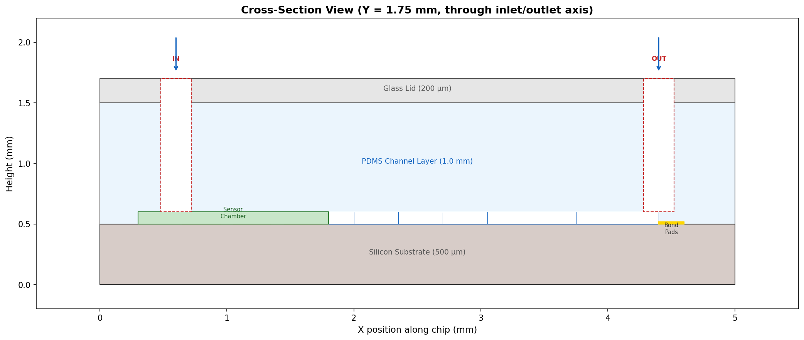

# PFAS Nanobiosensor — 3D Microfluidic Chip CAD Model

## Status: SOLVED — All 11/11 Geometric Specs Met

This is the physical 3D CAD model of the PFAS nanobiosensor designed in [`../simulation-pfas-design/`](../simulation-pfas-design/). The simulation proved the physics works — this folder turns it into a fabrication-ready chip design.

---

## The Chip at a Glance



A **5 mm x 3.5 mm** microfluidic chip with three zones:
- **Left**: Sensor chamber with gold interdigitated electrodes coated in PFAS-selective nanoparticles
- **Center**: Serpentine delay channel (21 mm path length in 6 U-turns) providing the 2-second transport delay
- **Right**: Bond pads (VDD, GND, OUT, CLK) for wire bonding to the readout ASIC

---

## 3D Layer Stack



The chip is built from 4 stacked layers:

| Layer | Material | Thickness | File |
|-------|----------|-----------|------|
| 1. Substrate | Silicon wafer | 500 um | `output/substrate.stl` |
| 2. Electrodes | Ti/Au (evaporated) | 100 nm | (part of substrate) |
| 3. Channel layer | PDMS (soft lithography) | 1.0 mm | `output/channels.stl` |
| 4. Lid | Glass cover | 200 um | `output/lid.stl` |

**Total assembled thickness: 1.7 mm**

The full assembly is in `output/chip_assembly.step` — open it in any CAD viewer (FreeCAD, Fusion 360, SolidWorks, OnShape) to inspect the 3D geometry.

---

## The Serpentine Channel — Key Feature



This is the most critical feature. The serpentine channel creates the **transport delay** (tau_d = 2.0 seconds) that shifts the sensor signal's peak timing.

| Parameter | Value |
|-----------|-------|
| Channel width | 200 um |
| Channel depth | 100 um |
| Wall between channels | 150 um |
| Number of U-turns | 6 |
| Total path length | 21.2 mm |
| Flow rate (design) | 10 uL/min |
| Resulting delay | ~2.0 seconds |

The serpentine fits in a 2.5 mm x 2.7 mm area in the center of the chip.

---

## Cross-Section



Cutting through the chip at Y = 1.75 mm (the inlet/outlet axis) shows the layer stack, the channel cuts in the PDMS, the sensor chamber, and the vertical inlet/outlet ports.

---

## Geometric Specs — All Passing

```
============================================================
  METRICS vs SPECS

    OK chip_length                5.0 mm     (target 5.0)      err=0.0%
    OK chip_width                 3.5 mm     (target 3.5)      err=0.0%
    OK channel_path_length        21.2 mm    (target 20.0)     err=6.2%
    OK channel_width              0.2 mm     (target 0.2)      err=0.0%
    OK channel_depth              0.1 mm     (target 0.1)      err=0.0%
    OK sensor_chamber_area        3.0 mm^2   (target 3.0)      err=0.0%
    OK n_bond_pads                4          (target 4)        exact
    OK inlet_diameter             0.5 mm     (target 0.5)      err=0.0%
    OK outlet_diameter            0.5 mm     (target 0.5)      err=0.0%
    OK step_file_valid            true                         valid
    OK stl_watertight             true                         manifold

  Score: 11/11 (100%)
============================================================
```

---

## Exported Files

| File | Format | Size | Use |
|------|--------|------|-----|
| `output/chip_assembly.step` | STEP | 288 KB | Open in any CAD software for 3D viewing/editing |
| `output/substrate.stl` | STL | 0.7 KB | 3D print or CNC the substrate |
| `output/channels.stl` | STL | 63 KB | PDMS mold master (invert for soft lithography) |
| `output/lid.stl` | STL | 51 KB | Glass lid with port holes |
| `output/top_view.svg` | SVG | 29 KB | 2D mask layout for photolithography |

### How to View the 3D Model

**Free options:**
- [FreeCAD](https://www.freecadweb.org/) — Open `chip_assembly.step`, all layers are separate bodies
- [OnShape](https://www.onshape.com/) — Free browser-based CAD, import the STEP file
- [3D Viewer Online](https://3dviewer.net/) — Drag and drop any STL file

**Professional:**
- Fusion 360, SolidWorks, CATIA — import STEP directly

---

## How to Reproduce

```bash
# Install dependencies
pip install cadquery matplotlib

# Build the 3D model (generates STEP, STL, SVG)
python3 model.py

# Run the evaluator (checks all 11 specs)
python3 evaluate.py

# Generate the visualization plots
python3 render.py
```

All dimensions are parametric in `dimensions.json` — change any value and rebuild.

---

## Connection to the Simulation

This CAD model implements exactly the physics from the simulation:

| Simulation State | Physical Component | CAD Feature |
|-----------------|-------------------|-------------|
| `x(t)` — sensor binding | MIP nanoparticles on Au electrodes | Sensor chamber + interdigitated electrodes |
| `xd(t)` — transport delay | Microfluidic serpentine channel | 6-pass serpentine, 21 mm path, tau_d = 2.0 s |
| `y(t)` — electrochemical output | CMOS readout ASIC | Bond pads for external chip connection |
| `z(t)` — output rate | Analog filter in ASIC | (electronic, not on this chip) |
| `b(t)` — burst amplification | DAC in ASIC | (electronic, not on this chip) |

The readout electronics (states y, z, b) are implemented on a separate CMOS die that wire-bonds to the 4 bond pads on this chip.
