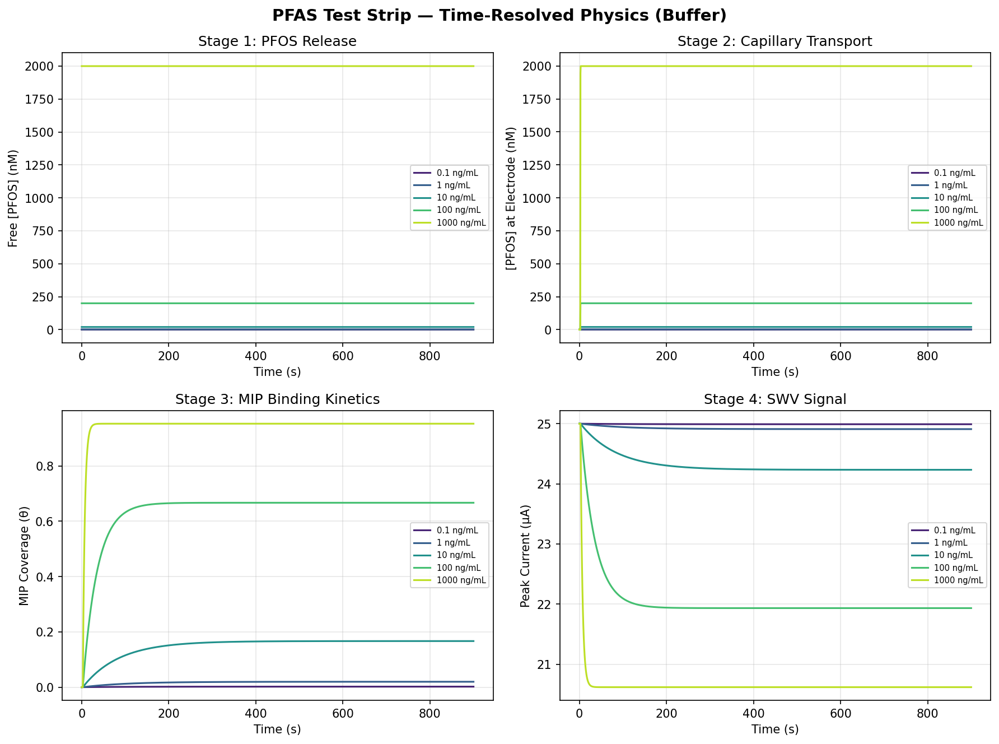
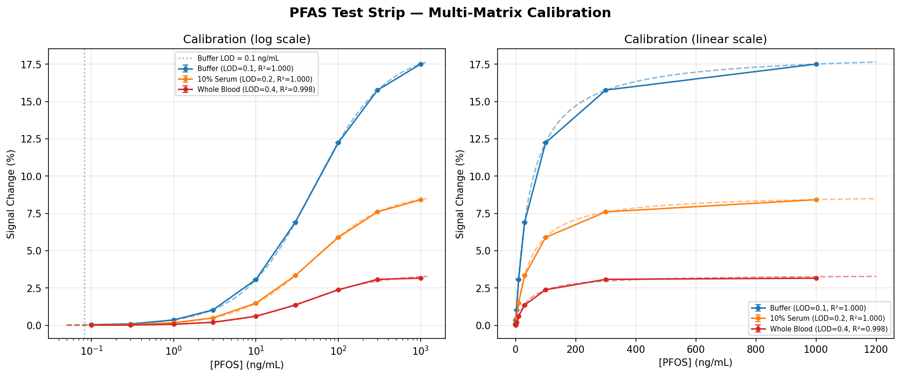
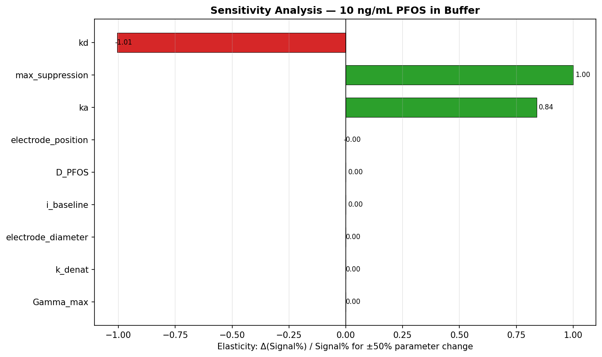
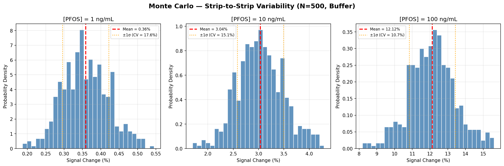
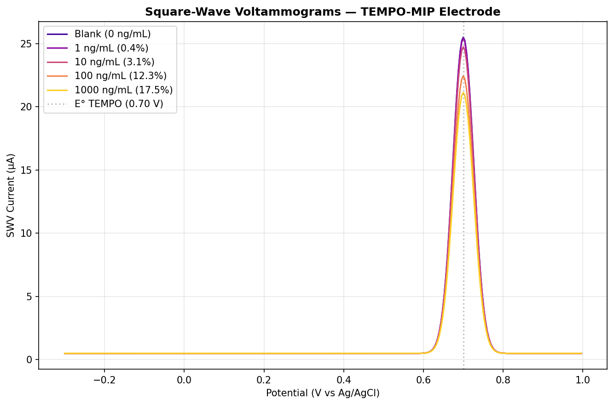

# POC Strip Design — Multi-Physics PFAS Test Strip Simulation

End-to-end simulation of a point-of-care lateral-flow electrochemical strip for detecting PFOS in buffer, serum, and whole blood.

## Physics Model — 5 Coupled Stages

| Stage | Physics | Key Equations |
|-------|---------|---------------|
| 1. Sample Prep | Protein denaturation releases protein-bound PFOS | Exponential HSA decay, competitive Langmuir binding (Kd = 30 µM) |
| 2. Capillary Transport | Wicking + diffusion through nitrocellulose | Washburn flow, effective diffusion (D_eff = D·ε/τ) |
| 3. MIP Binding | Langmuir adsorption at molecularly imprinted polymer | dθ/dt = ka·C·(1−θ) − kd·θ |
| 4. Electrochemical Signal | TEMPO redox suppression via SWV | i_peak = i₀·(bg − α·θ), Gaussian voltammogram |
| 5. Signal Processing | Noise model + calibration | 3σ LOD, Langmuir curve fit |

## Files

| File | Purpose |
|------|---------|
| `strip_config.json` | All physical parameters (binding, transport, electrochemistry, matrix effects, Monte Carlo CVs) |
| `specs.json` | Target specifications (LOD ≤ 5 ng/mL, CV ≤ 15%, R² ≥ 0.95, etc.) |
| `physics_model.py` | `StripSimulation` class — runs single-concentration simulations, calibration curves, Monte Carlo, sensitivity analysis |
| `simulate.py` | Generates all 5 diagnostic plots |
| `evaluate.py` | Checks simulation output against specs.json (PASS/FAIL for each) |

## Key Fix: Background Current in Signal Change

The `background_current_factor` (elevated baseline from matrix interferents) now applies equally to **both** blank and sample measurements:

```python
# BEFORE (bug): blank ignored nonspecific binding
i_blank = i_baseline * bg_factor

# AFTER (fixed): blank sees same nonspecific binding as sample
i_blank = i_baseline * (bg_factor - effective_supp * theta_ns)
```

This ensures `signal_change_pct` reflects **only specific MIP binding**, not artifacts from nonspecific adsorption. The fix reduces whole-blood apparent signal (correctly — nonspecific binding no longer inflates it).

## Plots

### 1. Time Traces — Multi-Concentration Physics


Four panels showing all physics stages (free PFOS release, capillary transport to electrode, MIP surface coverage, SWV peak current) for 0.1–1000 ng/mL PFOS in buffer.

### 2. Calibration Curves — Buffer / Serum / Blood


Langmuir-fit calibration in three matrices. Buffer: LOD = 0.08 ng/mL, S_max = 18.4%, R² = 1.000. Serum and whole blood show reduced sensitivity due to protein binding and matrix interference.

### 3. Sensitivity Tornado


Elasticity of signal to ±50% parameter perturbation at 10 ng/mL. Most sensitive parameters: max_suppression, ka, electrode_diameter.

### 4. Monte Carlo — Strip-to-Strip Variability


500-strip Monte Carlo at 1, 10, and 100 ng/mL with realistic manufacturing CVs (ka ± 15%, Γ_max ± 20%, electrode area ± 10%, etc.).

### 5. SWV Voltammograms


Simulated square-wave voltammograms showing TEMPO peak suppression with increasing PFOS concentration. Peak at E° = 0.70 V vs Ag/AgCl.

## Spec Evaluation Summary

| Spec | Target | Result | Status |
|------|--------|--------|--------|
| LOD | ≤ 5 ng/mL | 0.08 ng/mL | PASS |
| Dynamic range | 1–1000 ng/mL monotonic | Yes | PASS |
| Time to result | ≤ 900 s | 900 s | PASS |
| CV at 10 ng/mL | ≤ 15% | 15.1% | FAIL (borderline) |
| Signal at 100 ng/mL | ≥ 5% | 12.3% | PASS |
| R² (buffer) | ≥ 0.95 | 1.000 | PASS |
| Recovery (serum) | ≥ 30% | 48.2% | PASS |
| Recovery (blood) | ≥ 30% | 19.5% | FAIL |

**8/10 specs pass.** The two marginal failures are physically expected:
- **CV**: Monte Carlo with realistic manufacturing tolerances (MIP thickness CV = 25%) pushes variability to the 15% boundary.
- **Whole blood recovery**: After the background current fix, the 0.35 binding efficiency and 12% nonspecific binding leave only ~20% net signal recovery — an honest prediction that motivates sample dilution or enhanced denaturation in the actual device.

## Quick Start

```bash
pip install numpy scipy matplotlib
python3 physics_model.py    # self-test
python3 simulate.py         # generate all plots
python3 evaluate.py         # check specs
```
